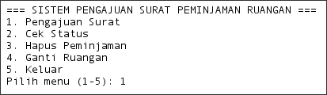
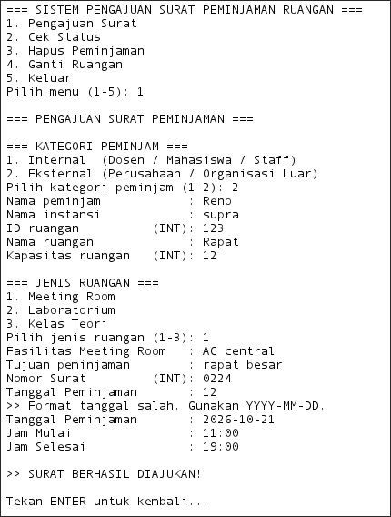
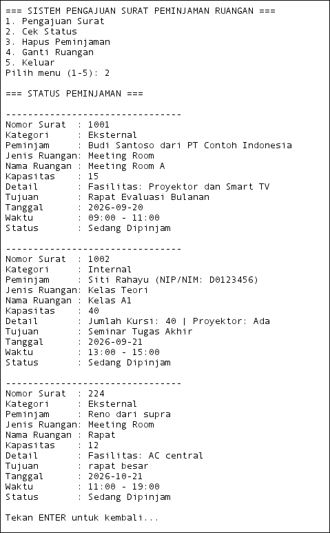
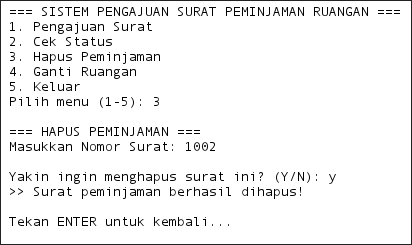
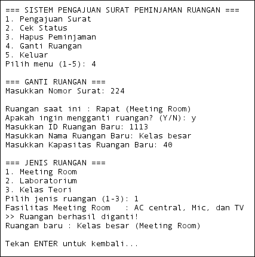
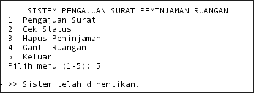
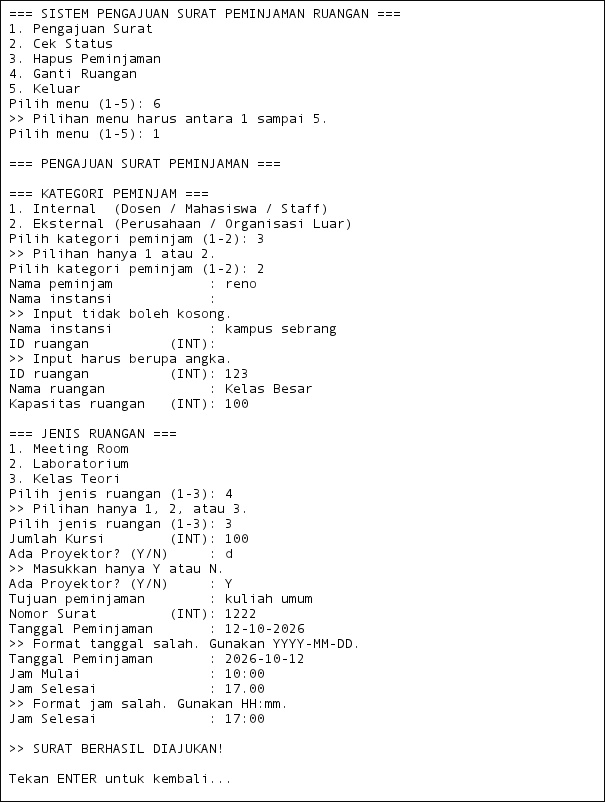

# Sistem Pengajuan Surat Peminjaman Ruangan

Aplikasi **console-based** berbasis Java untuk mengelola pengajuan surat peminjaman ruangan di lingkungan kampus. Program ini dibangun dengan menerapkan konsep **Pemrograman Berorientasi Objek (OOP)** secara penuh — *encapsulation*, *inheritance*, *polymorphism*, dan *abstraction* — serta pola arsitektur **MVC (Model-View-Controller)**.

---

## Daftar Isi

- [Deskripsi Singkat Program](#deskripsi-singkat-program)
- [Struktur Package](#struktur-package)
- [Alur Program](#alur-program)
- [Encapsulation dan Inheritance](#encapsulation-dan-inheritance)
- [Polymorphism dan Abstraction](#polymorphism-dan-abstraction)
- [Validasi Input](#validasi-input)

---

## Deskripsi Singkat Program

Program ini adalah sistem berbasis teks (CLI) yang memungkinkan pengguna mengajukan, melihat, menghapus, dan mengganti surat peminjaman ruangan kampus. Ruangan yang tersedia ada tiga jenis: **Meeting Room**, **Laboratorium**, dan **Kelas Teori**. Pihak peminjam dibagi dua kategori: **Internal** (dosen/mahasiswa/staff) dan **Eksternal** (perusahaan/organisasi luar).

**Fitur utama:**

| No | Menu | Keterangan |
|----|------|------------|
| 1 | Pengajuan Surat | Mengisi dan menyimpan data peminjaman baru |
| 2 | Cek Status | Menampilkan seluruh daftar peminjaman |
| 3 | Hapus Peminjaman | Menghapus surat peminjaman berdasarkan nomor surat |
| 4 | Ganti Ruangan | Mengganti ruangan pada peminjaman yang sudah ada |
| 5 | Keluar | Menghentikan program |

Program dijalankan dari class `Peminjamanruangan.java` sebagai titik masuk (*entry point*):

```java
public static void main(String[] args) {
    Scanner scanner = new Scanner(System.in);
    peminjamanView view = new peminjamanView(scanner);
    PeminjamanController controller = new PeminjamanController(view);
    controller.jalankan();
    scanner.close();
}
```

`main` tidak mengandung logika apapun — tugasnya hanya merakit objek `View` dan `Controller`, lalu menyerahkan kendali sepenuhnya ke `controller.jalankan()`.



---

## Struktur Package

Program disusun menggunakan pola **MVC**, di mana setiap lapisan punya tanggung jawab yang jelas dan terpisah.

```
com.mycompany.peminjamanruangan
│
├── Peminjamanruangan.java          ← Entry point (method main)
│
├── model/                          ← MODEL: struktur data & objek bisnis
│   ├── Ruangan.java                   Abstract class (superclass ruangan)
│   ├── MeetingRoom.java               Subclass Ruangan
│   ├── Laboratorium.java              Subclass Ruangan
│   ├── KelasTeori.java                Subclass Ruangan
│   ├── Peminjam.java                  Abstract class (superclass peminjam)
│   ├── PeminjamInternal.java          Subclass Peminjam
│   ├── PeminjamEksternal.java         Subclass Peminjam
│   ├── Jadwal.java                    Data jadwal peminjaman
│   └── Peminjaman.java                Objek surat peminjaman
│
├── View/                           ← VIEW: tampilan & pembacaan input
│   └── peminjamanView.java
│
└── controller/                     ← CONTROLLER: alur & logika bisnis
    └── PeminjamanController.java
```

### Tanggung Jawab Setiap Package

| Package | Tanggung Jawab |
|---------|----------------|
| `model` | Menyimpan **struktur data** dan **atribut objek**. Tidak berisi logika alur program maupun tampilan. |
| `View` | Menangani **semua interaksi dengan pengguna** — menampilkan menu, membaca input, mencetak output ke layar. Tidak menyimpan data. |
| `controller` | Mengatur **alur program dan logika bisnis** — memanggil `View` untuk input/output, menyimpan/mengubah/menghapus data di `ArrayList`, dan memutuskan objek `model` apa yang dibuat. |

### Diagram Hubungan Antar-Class

```
Peminjamanruangan (main)
    │
    ├──► peminjamanView
    │
    └──► PeminjamanController
              │
              └──► ArrayList<Peminjaman>
                        │
                        ├──► Peminjam (abstract)
                        │       ├── PeminjamInternal
                        │       └── PeminjamEksternal
                        │
                        ├──► Ruangan (abstract)
                        │       ├── MeetingRoom
                        │       ├── Laboratorium
                        │       └── KelasTeori
                        │
                        └──► Jadwal
```

---

## Alur Program

### Gambaran Umum

1. **Program dijalankan** melalui `main()` di `Peminjamanruangan.java`.
2. Constructor `PeminjamanController` otomatis memanggil `dummy()`, memasukkan dua data contoh ke `ArrayList` agar langsung ada data saat program pertama berjalan.
3. `controller.jalankan()` dipanggil — masuk ke **loop utama** `while(berjalan)` yang terus berjalan selama pengguna belum memilih *Keluar*.
4. Setiap iterasi, menu ditampilkan dan pilihan pengguna dibaca dan divalidasi.
5. `switch` mengarahkan ke salah satu method: `ajukanSurat()`, `tampilkanStatus()`, `hapusSurat()`, `gantiRuangan()`, atau menghentikan loop.
6. Saat pengguna memilih **5 (Keluar)**, flag `berjalan` diset `false`, loop berhenti, `scanner.close()` dipanggil, dan program selesai.

```java
// PeminjamanController.java
public void jalankan() {
    boolean berjalan = true;
    while (berjalan) {
        view.tampilkanMenu();
        switch (view.bacaPilihanMenu()) {
            case 1 -> ajukanSurat();
            case 2 -> tampilkanStatus();
            case 3 -> hapusSurat();
            case 4 -> gantiRuangan();
            case 5 -> {
                berjalan = false;
                view.pesan("\n>> Sistem telah dihentikan.");
            }
        }
    }
}
```


---

### Menu 1 — Pengajuan Surat

Pengguna mengisi data secara berurutan. Setiap field divalidasi sebelum lanjut ke field berikutnya. Setelah semua data valid, controller membentuk objek `Peminjam` (Internal/Eksternal), `Ruangan` (MeetingRoom/Laboratorium/KelasTeori), dan `Jadwal`, lalu membungkus ketiganya ke dalam `Peminjaman` baru yang disimpan ke `ArrayList`.

```java
// PeminjamanController.java — helper membuat Peminjam (polimorfisme)
private Peminjam buatPeminjam() {
    int kategori = view.pilihKategoriPeminjam();
    String nama  = view.bacaString("Nama peminjam            : ");
    if (kategori == 1) {
        String nip = view.bacaString("NIP / NIM                : ");
        return new PeminjamInternal(nama, nip);
    } else {
        String instansi = view.bacaString("Nama instansi            : ");
        return new PeminjamEksternal(nama, instansi);
    }
}

// helper membuat Ruangan (polimorfisme)
private Ruangan buatRuangan(int id, String nama, int kapasitas) {
    int jenis = view.pilihJenisRuangan();
    switch (jenis) {
        case 1 -> {
            String fasilitas = view.bacaString("Fasilitas Meeting Room   : ");
            return new MeetingRoom(id, nama, kapasitas, false, fasilitas);
        }
        case 2 -> {
            String jenisLab = view.bacaString("Jenis Laboratorium       : ");
            return new Laboratorium(id, nama, kapasitas, false, jenisLab);
        }
        default -> {
            int kursi = view.bacaInt("Jumlah Kursi        (INT): ");
            boolean proyektor = view.bacaKonfirmasi(
                    "Ada Proyektor? (Y/N)     : ").equalsIgnoreCase("Y");
            return new KelasTeori(id, nama, kapasitas, false, kursi, proyektor);
        }
    }
}
```



---

### Menu 2 — Cek Status

Controller mengecek apakah `daftarPeminjaman` kosong. Jika tidak, ia mengiterasi seluruh isi `ArrayList` dan meminta `View` mencetak detail setiap `Peminjaman`.

```java
// PeminjamanController.java
private void tampilkanStatus() {
    if (daftarPeminjaman.isEmpty()) {
        view.pesan(">> Belum ada data peminjaman.");
    } else {
        for (Peminjaman p : daftarPeminjaman)
            view.tampilkanStatus(p);
    }
    view.tekanEnter();
}
```

```java
// peminjamanView.java — polimorfisme bekerja di sini saat runtime
public void tampilkanStatus(Peminjaman p) {
    System.out.println("Kategori     : " + p.getPeminjam().getKategori());
    System.out.println("Peminjam     : " + p.getPeminjam().getIdentitas());
    System.out.println("Jenis Ruangan: " + p.getRuangan().getJenisRuangan());
    System.out.println("Detail       : " + p.getRuangan().getDetailRuangan());
    // ...
}
```



---

### Menu 3 — Hapus Peminjaman

Pengguna memasukkan nomor surat. Controller mencari `Peminjaman` yang cocok; jika ditemukan, pengguna diminta konfirmasi `Y/N` sebelum data dihapus dari `ArrayList`.

```java
// PeminjamanController.java
private void hapusSurat() {
    int nomor = view.bacaInt("Masukkan Nomor Surat: ");
    Peminjaman p = cariPeminjaman(nomor);

    if (p == null) {
        view.pesan(">> Nomor surat tidak ditemukan.");
    } else if (view.bacaKonfirmasi("\nYakin ingin menghapus surat ini? (Y/N): ")
                   .equalsIgnoreCase("Y")) {
        daftarPeminjaman.remove(p);
        view.pesan(">> Surat peminjaman berhasil dihapus!");
    } else {
        view.pesan(">> Penghapusan dibatalkan.");
    }
    view.tekanEnter();
}
```



---

### Menu 4 — Ganti Ruangan

Controller mencari `Peminjaman` berdasarkan nomor surat, menampilkan ruangan saat ini, meminta konfirmasi, lalu membaca data ruangan baru. Setelah valid, objek `Ruangan` baru dibuat dan dipasang ke `Peminjaman` yang sama melalui setter.

```java
// PeminjamanController.java
Ruangan ruanganBaru = buatRuangan(idBaru, nama, kapasitas);
p.setRuangan(ruanganBaru);  // hanya field ruangan yang diganti, bukan seluruh objek Peminjaman
```



---

### Menu 5 — Keluar

```java
case 5 -> {
    berjalan = false;
    view.pesan("\n>> Sistem telah dihentikan.");
}
```

Flag `berjalan` menjadi `false`, loop `while` berhenti, kendali kembali ke `main()`, `scanner.close()` dipanggil, dan program berakhir.



---

## Encapsulation dan Inheritance

### Encapsulation

**Encapsulation** adalah prinsip menyembunyikan detail internal objek dan hanya mengekspos apa yang diperlukan melalui method yang terkontrol.

Seluruh atribut di semua class model dideklarasikan `private`. Akses ke atribut tersebut hanya bisa dilakukan melalui **getter** dan **setter** `public`.

```java
// model/Ruangan.java
public abstract class Ruangan {
    private int idRuangan;       // tidak bisa diakses langsung dari luar
    private String namaRuangan;
    private int kapasitas;
    private boolean tersedia;

    // Satu-satunya cara membaca nilai dari luar class
    public int getIdRuangan()       { return idRuangan; }
    public String getNamaRuangan()  { return namaRuangan; }
    public int getKapasitas()       { return kapasitas; }
    public boolean isTersedia()     { return tersedia; }

    // Satu-satunya cara mengubah nilai dari luar class
    public void setIdRuangan(int idRuangan)       { this.idRuangan = idRuangan; }
    public void setNamaRuangan(String namaRuangan){ this.namaRuangan = namaRuangan; }
    public void setKapasitas(int kapasitas)       { this.kapasitas = kapasitas; }
    public void setTersedia(boolean tersedia)     { this.tersedia = tersedia; }
    // ...
}
```

```java
// model/Peminjaman.java
public class Peminjaman {
    private Peminjam peminjam;   // private — tidak bisa disentuh langsung dari luar
    private String tujuan;
    private int nomorSurat;
    private Ruangan ruangan;
    private Jadwal jadwal;

    public Peminjam getPeminjam()              { return peminjam; }
    public Ruangan getRuangan()                { return ruangan; }
    public void setRuangan(Ruangan ruangan)    { this.ruangan = ruangan; }
    // ...
}
```

```java
// controller/PeminjamanController.java
private final ArrayList<Peminjaman> daftarPeminjaman = new ArrayList<>();
private final peminjamanView view;
// ArrayList ini hanya bisa diakses oleh method-method di dalam controller ini sendiri
```

Berkat encapsulation, fitur **Ganti Ruangan** bisa berjalan aman:

```java
p.setRuangan(ruanganBaru);  // mengganti ruangan lewat setter, bukan akses langsung ke field
```

---

### Inheritance

**Inheritance** (pewarisan) memungkinkan sebuah class mewarisi atribut dan method dari class lain, sehingga kode yang sama tidak perlu ditulis ulang.

Program ini memiliki **dua hierarki inheritance** yang saling independen:

#### Hierarki Ruangan

`Ruangan` sebagai superclass abstrak, dengan tiga subclass konkret.

```java
// model/Ruangan.java — superclass
public abstract class Ruangan {
    private int idRuangan;
    private String namaRuangan;
    private int kapasitas;
    private boolean tersedia;

    public Ruangan(int idRuangan, String namaRuangan, int kapasitas, boolean tersedia) {
        this.idRuangan = idRuangan;
        this.namaRuangan = namaRuangan;
        this.kapasitas = kapasitas;
        this.tersedia = tersedia;
    }
    // getter & setter ...
}
```

```java
// model/MeetingRoom.java — subclass, mewarisi Ruangan
public class MeetingRoom extends Ruangan {
    private String fasilitas;   // atribut tambahan khusus MeetingRoom

    public MeetingRoom(int idRuangan, String namaRuangan, int kapasitas,
                       boolean tersedia, String fasilitas) {
        super(idRuangan, namaRuangan, kapasitas, tersedia); // memanggil constructor Ruangan
        this.fasilitas = fasilitas;
    }
}
```

```java
// model/Laboratorium.java — subclass, mewarisi Ruangan
public class Laboratorium extends Ruangan {
    private String jenisLaboratorium;

    public Laboratorium(int idRuangan, String namaRuangan, int kapasitas,
                        boolean tersedia, String jenisLaboratorium) {
        super(idRuangan, namaRuangan, kapasitas, tersedia);
        this.jenisLaboratorium = jenisLaboratorium;
    }
}
```

```java
// model/KelasTeori.java — subclass ketiga, mewarisi Ruangan
public class KelasTeori extends Ruangan {
    private int jumlahKursi;
    private boolean adaProyektor;

    public KelasTeori(int idRuangan, String namaRuangan, int kapasitas,
                      boolean tersedia, int jumlahKursi, boolean adaProyektor) {
        super(idRuangan, namaRuangan, kapasitas, tersedia);
        this.jumlahKursi = jumlahKursi;
        this.adaProyektor = adaProyektor;
    }
}
```

Kata kunci `extends Ruangan` berarti `MeetingRoom`, `Laboratorium`, dan `KelasTeori` **otomatis memiliki** `idRuangan`, `namaRuangan`, `kapasitas`, `tersedia`, beserta seluruh getter/setter-nya — tanpa menulis ulang. `super(...)` di constructor meneruskan empat parameter umum ke constructor `Ruangan`.

#### Hierarki Peminjam

`Peminjam` sebagai superclass abstrak, dengan dua subclass konkret.

```java
// model/Peminjam.java — superclass
public abstract class Peminjam {
    private String nama;

    public Peminjam(String nama) {
        this.nama = nama;
    }

    public String getNama() { return nama; }
    public void setNama(String nama) { this.nama = nama; }
}
```

```java
// model/PeminjamInternal.java — subclass, mewarisi Peminjam
public class PeminjamInternal extends Peminjam {
    private String nip;   // atribut tambahan khusus peminjam internal

    public PeminjamInternal(String nama, String nip) {
        super(nama);      // memanggil constructor Peminjam
        this.nip = nip;
    }
}
```

```java
// model/PeminjamEksternal.java — subclass, mewarisi Peminjam
public class PeminjamEksternal extends Peminjam {
    private String namaInstansi;

    public PeminjamEksternal(String nama, String namaInstansi) {
        super(nama);
        this.namaInstansi = namaInstansi;
    }
}
```

---

## Polymorphism dan Abstraction

### Abstraction

**Abstraction** adalah prinsip menyembunyikan detail implementasi dan hanya memperlihatkan "kontrak" — apa yang harus bisa dilakukan sebuah objek, bukan bagaimana caranya.

Program ini memiliki **dua abstract class**, masing-masing mendefinisikan abstract method yang **wajib** diimplementasikan oleh subclassnya.

#### Abstract Class `Ruangan`

```java
// model/Ruangan.java
public abstract class Ruangan {
    // ... atribut & constructor ...

    /**
     * Setiap jenis ruangan WAJIB memberikan label jenisnya sendiri.
     * Ruangan tidak bisa diinstansiasi langsung karena belum ada
     * implementasi konkret untuk method ini.
     */
    public abstract String getJenisRuangan();

    /**
     * Setiap jenis ruangan WAJIB mendeskripsikan detailnya sendiri.
     */
    public abstract String getDetailRuangan();
}
```

Karena `Ruangan` bersifat `abstract`, kode berikut akan **gagal dikompilasi**:

```java
Ruangan r = new Ruangan(...); // ERROR — tidak bisa membuat objek dari abstract class
```

Yang benar adalah membuat objek dari subclass konkretnya:

```java
Ruangan r = new MeetingRoom(...);    // OK
Ruangan r = new Laboratorium(...);   // OK
Ruangan r = new KelasTeori(...);     // OK
```

#### Abstract Class `Peminjam`

```java
// model/Peminjam.java
public abstract class Peminjam {
    // ... atribut & constructor ...

    /**
     * Setiap kategori peminjam WAJIB memberikan format identitasnya sendiri.
     */
    public abstract String getIdentitas();

    /**
     * Setiap kategori peminjam WAJIB memberikan label kategorinya sendiri.
     */
    public abstract String getKategori();
}
```

Abstraction memungkinkan `PeminjamanController` dan `peminjamanView` bekerja dengan tipe umum `Ruangan` dan `Peminjam` tanpa perlu tahu detail subclass yang sesungguhnya — controller cukup memanggil `getJenisRuangan()` atau `getIdentitas()`, dan implementasi yang tepat akan berjalan secara otomatis.


---

### Polymorphism

**Polymorphism** adalah kemampuan satu referensi bertipe umum untuk menunjuk ke objek dari berbagai subclass, dan memanggil method yang berbeda-beda hasilnya tergantung tipe objek sesungguhnya saat runtime.

#### Polymorphism pada Ruangan

Tiga subclass `Ruangan` masing-masing mengimplementasikan `getJenisRuangan()` dan `getDetailRuangan()` secara berbeda:

```java
// model/MeetingRoom.java
@Override
public String getJenisRuangan() {
    return "Meeting Room";
}

@Override
public String getDetailRuangan() {
    return "Fasilitas: " + fasilitas;
}
```

```java
// model/Laboratorium.java
@Override
public String getJenisRuangan() {
    return "Laboratorium";
}

@Override
public String getDetailRuangan() {
    return "Jenis: " + jenisLaboratorium;
}
```

```java
// model/KelasTeori.java
@Override
public String getJenisRuangan() {
    return "Kelas Teori";
}

@Override
public String getDetailRuangan() {
    return "Jumlah Kursi: " + jumlahKursi
            + " | Proyektor: " + (adaProyektor ? "Ada" : "Tidak Ada");
}
```

#### Polymorphism pada Peminjam

Dua subclass `Peminjam` mengimplementasikan `getIdentitas()` dan `getKategori()` berbeda:

```java
// model/PeminjamInternal.java
@Override
public String getIdentitas() {
    return getNama() + " (NIP/NIM: " + nip + ")";
}

@Override
public String getKategori() {
    return "Internal";
}
```

```java
// model/PeminjamEksternal.java
@Override
public String getIdentitas() {
    return getNama() + " dari " + namaInstansi;
}

@Override
public String getKategori() {
    return "Eksternal";
}
```

#### Polimorfisme saat Runtime di `peminjamanView`

Baris kode pemanggilan di `tampilkanStatus()` **persis sama** untuk semua jenis ruangan maupun semua kategori peminjam — Java yang menentukan implementasi mana yang dijalankan berdasarkan tipe objek sesungguhnya:

```java
// peminjamanView.java
public void tampilkanStatus(Peminjaman p) {
    // getKategori() → "Internal" atau "Eksternal" tergantung subclass Peminjam
    System.out.println("Kategori     : " + p.getPeminjam().getKategori());

    // getIdentitas() → format berbeda untuk Internal vs Eksternal
    System.out.println("Peminjam     : " + p.getPeminjam().getIdentitas());

    // getJenisRuangan() → "Meeting Room", "Laboratorium", atau "Kelas Teori"
    System.out.println("Jenis Ruangan: " + p.getRuangan().getJenisRuangan());

    // getDetailRuangan() → isi berbeda tergantung jenis ruangan
    System.out.println("Detail       : " + p.getRuangan().getDetailRuangan());
}
```

#### Upcasting (menyimpan subclass ke referensi superclass)

Di `PeminjamanController`, variabel `Ruangan` dan `Peminjam` bertipe abstrak, namun bisa menampung objek subclass mana pun:

```java
// PeminjamanController.java — buatRuangan()
// Variabel bertipe Ruangan (abstract), tapi objeknya bisa berupa salah satu dari tiga subclass
Ruangan ruangan;
switch (jenis) {
    case 1 -> ruangan = new MeetingRoom(id, nama, kapasitas, false, fasilitas);
    case 2 -> ruangan = new Laboratorium(id, nama, kapasitas, false, jenisLab);
    default-> ruangan = new KelasTeori(id, nama, kapasitas, false, kursi, proyektor);
}
```

```java
// PeminjamanController.java — buatPeminjam()
// Variabel bertipe Peminjam (abstract), bisa menampung Internal atau Eksternal
Peminjam peminjam;
if (kategori == 1) {
    peminjam = new PeminjamInternal(nama, nip);
} else {
    peminjam = new PeminjamEksternal(nama, instansi);
}
```

```java
// model/Peminjaman.java — field bertipe abstract class, bukan subclass konkret
private Peminjam peminjam;   // bisa menampung Internal atau Eksternal
private Ruangan ruangan;     // bisa menampung MeetingRoom, Laboratorium, atau KelasTeori
```

#### Dummy Data sebagai Bukti Polymorphism

Constructor controller memasukkan dua data dummy yang masing-masing menggunakan kombinasi subclass berbeda, membuktikan polimorfisme bekerja:

```java
// PeminjamanController.java — dummy()
// Dummy 1: PeminjamEksternal + MeetingRoom
Peminjam peminjam1 = new PeminjamEksternal("Budi Santoso", "PT Contoh Indonesia");
Ruangan  ruangan1  = new MeetingRoom(201, "Meeting Room A", 15, false, "Proyektor dan Smart TV");
daftarPeminjaman.add(new Peminjaman(peminjam1, "Rapat Evaluasi Bulanan", 1001, ruangan1, jadwal1));

// Dummy 2: PeminjamInternal + KelasTeori
Peminjam peminjam2 = new PeminjamInternal("Siti Rahayu", "D0123456");
Ruangan  ruangan2  = new KelasTeori(101, "Kelas A1", 40, false, 40, true);
daftarPeminjaman.add(new Peminjaman(peminjam2, "Seminar Tugas Akhir", 1002, ruangan2, jadwal2));
```

Ketika kedua data ini ditampilkan lewat `tampilkanStatus()`, **baris kode yang sama** menghasilkan output yang berbeda — inilah inti dari polymorphism.

---

## Validasi Input

Semua pembacaan input pengguna dipusatkan di `peminjamanView`. Setiap method membungkus input dalam `while(true)` yang hanya berhenti saat input dinyatakan valid. Controller tidak pernah menerima data mentah yang belum tervalidasi.

### Tabel Validasi

| Validasi | Method di `peminjamanView` | Aturan |
|----------|---------------------------|--------|
| String tidak kosong | `bacaString()` | Input di-*trim*, ditolak jika `isEmpty()` |
| Input harus angka | `bacaInt()` | Menangkap `NumberFormatException` dari `Integer.parseInt()` |
| Format tanggal | `bacaTanggal()` | Pola `yyyy-MM-dd`, divalidasi dengan `LocalDate.parse()` |
| Format jam | `bacaJam()` | Pola `HH:mm`, divalidasi dengan `LocalTime.parse()` |
| Konfirmasi Y/N | `bacaKonfirmasi()` | Hanya menerima `"Y"` atau `"N"` (tidak *case-sensitive*) |
| Pilihan menu | `bacaPilihanMenu()` | Harus angka 1–5 |
| Kategori peminjam | `pilihKategoriPeminjam()` | Harus `1` atau `2` |
| Jenis ruangan | `pilihJenisRuangan()` | Harus `1`, `2`, atau `3` |

### Kode Validasi Format

```java
// peminjamanView.java — input string tidak boleh kosong
public String bacaString(String pesan) {
    while (true) {
        System.out.print(pesan);
        String input = scanner.nextLine().trim();
        if (!input.isEmpty()) return input;
        System.out.println(">> Input tidak boleh kosong.");
    }
}
```

```java
// peminjamanView.java — input harus berupa angka bulat
public int bacaInt(String pesan) {
    while (true) {
        System.out.print(pesan);
        try {
            return Integer.parseInt(scanner.nextLine().trim());
        } catch (NumberFormatException e) {
            System.out.println(">> Input harus berupa angka.");
        }
    }
}
```

```java
// peminjamanView.java — format tanggal harus yyyy-MM-dd
public String bacaTanggal(String pesan) {
    DateTimeFormatter formatter = DateTimeFormatter.ofPattern("yyyy-MM-dd");
    while (true) {
        System.out.print(pesan);
        String input = scanner.nextLine().trim();
        try {
            LocalDate.parse(input, formatter);
            return input;
        } catch (DateTimeParseException e) {
            System.out.println(">> Format tanggal salah. Gunakan YYYY-MM-DD.");
        }
    }
}
```

```java
// peminjamanView.java — format jam harus HH:mm
public String bacaJam(String pesan) {
    DateTimeFormatter formatter = DateTimeFormatter.ofPattern("HH:mm");
    while (true) {
        System.out.print(pesan);
        String input = scanner.nextLine().trim();
        try {
            LocalTime.parse(input, formatter);
            return input;
        } catch (DateTimeParseException e) {
            System.out.println(">> Format jam salah. Gunakan HH:mm.");
        }
    }
}
```

```java
// peminjamanView.java — konfirmasi hanya Y atau N
public String bacaKonfirmasi(String pesan) {
    while (true) {
        System.out.print(pesan);
        String input = scanner.nextLine().trim();
        if (input.equalsIgnoreCase("Y") || input.equalsIgnoreCase("N")) return input;
        System.out.println(">> Masukkan hanya Y atau N.");
    }
}
```

### Validasi Bisnis (di Controller)

Selain validasi format, `PeminjamanController` menerapkan validasi bisnis yang membutuhkan akses ke data yang sudah tersimpan:

```java
// PeminjamanController.java — ID ruangan dan nomor surat harus unik
while (true) {
    idRuangan = view.bacaInt("ID ruangan          (INT): ");
    if (idRuangan <= 0) {
        view.pesan(">> ID ruangan harus lebih dari 0.");
        continue;
    }
    if (idRuanganSudahDigunakan(idRuangan)) {
        view.pesan(">> ID ruangan tersebut sudah digunakan.");
        continue;
    }
    break;
}
```

```java
// PeminjamanController.java — jam selesai harus setelah jam mulai
while (true) {
    jamSelesai = view.bacaJam("Jam Selesai              : ");
    LocalTime mulai   = LocalTime.parse(jamMulai,   DateTimeFormatter.ofPattern("HH:mm"));
    LocalTime selesai = LocalTime.parse(jamSelesai, DateTimeFormatter.ofPattern("HH:mm"));
    if (selesai.isAfter(mulai)) break;
    view.pesan(">> Jam selesai harus setelah jam mulai.");
}
```

```java
// PeminjamanController.java — kapasitas dan jumlah kursi harus > 0
while (true) {
    kapasitas = view.bacaInt("Kapasitas ruangan   (INT): ");
    if (kapasitas > 0) break;
    view.pesan(">> Kapasitas harus lebih dari 0.");
}
```


